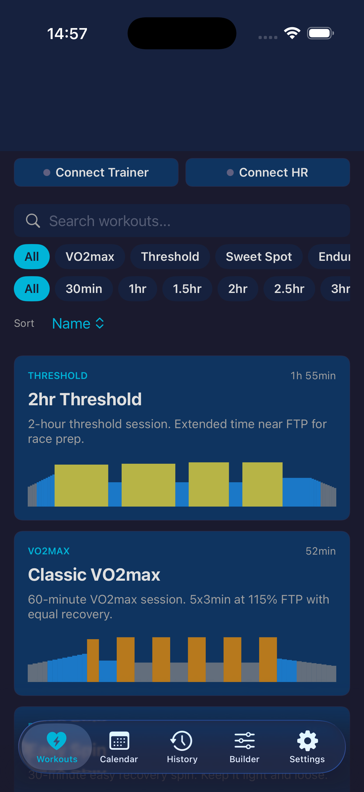

# CycleJames iOS

<p align="center">
  
</p>

Native iOS port of the [CycleJames](https://github.com/FromArkZoo/CycleJames) web app. SwiftUI cycling-trainer app that connects to FTMS-compatible smart trainers (Wattbike Atom Next Gen, Wahoo KICKR, Tacx, Elite, etc.) and standard Bluetooth heart-rate monitors.

The web version uses Web Bluetooth which iOS Safari doesn't support. This native port uses CoreBluetooth instead, so it actually pairs and controls the trainer on iPhone.

## Stack

- SwiftUI · SwiftData · Swift Charts · CoreBluetooth · AVFoundation
- iOS 17+ · Swift 6.2 · Xcode 26

## Features

- 22 built-in workouts across Recovery, Endurance, Sweet Spot, Threshold, VO2max categories
- FTMS Bluetooth: Indoor Bike Data parsing + ERG mode target-power control
- Standard Bluetooth heart-rate service (0x180D)
- 5-second pre-ride countdown with audio beeps; interval transition warnings
- Per-second sample recording (downsampled for rides over 90/150 min)
- Live metrics: power (3s rolling), target, cadence, HR, NP, IF, TSS, zone
- Save & Stop / Discard & Stop mid-ride
- 5 tabs: Workouts (filter+search+sort) · Calendar (monthly with ride markers) · History (with target-vs-actual chart) · Workout Builder · Settings

## Build

Open `CycleJames.xcodeproj` in Xcode, set your team in Signing & Capabilities, run on a real device or simulator.

The Xcode project is generated from `project.yml` via [XcodeGen](https://github.com/yonaskolb/XcodeGen). To regenerate after adding files:

```bash
brew install xcodegen
xcodegen
```

## Layout

```
CycleJames/
├── Models/         Workout, Interval, Zone, RideSessionModel (SwiftData), CustomWorkoutModel
├── Domain/         WorkoutPlayer, RideController, RideRecorder, PowerMetrics
├── Bluetooth/      FTMSManager, HRManager, TrainerData
├── Library/        BuiltInWorkouts (22 workouts), WorkoutFilter
├── Audio/          AudioCues (sine-wave beeps via AVAudioEngine)
├── DesignSystem/   Colors, Typography, Spacing
└── Views/          Workouts · Ride · Graph · History · Calendar · Builder · Settings
```
